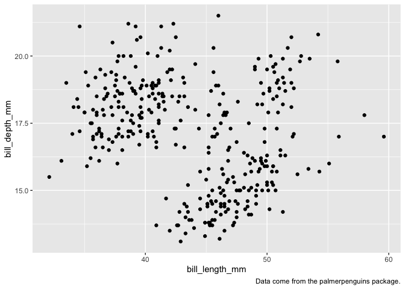

# Chapter 1


#### 1.2.5 Exercises

1.  How many rows are in `penguins`? How many columns?

``` r
nrow(penguins)
```

    [1] 344

``` r
ncol(penguins)
```

    [1] 8

2.  What does the `bill_depth_mm` variable in the `penguins` data frame
    describe? Read the help for
    [`?penguins`](https://allisonhorst.github.io/palmerpenguins/reference/penguins.html)
    to find out.

    `bill_depth_mm` is “a number denoting bill depth (millimeters)”

3.  Make a scatterplot of `bill_depth_mm` vs. `bill_length_mm`. That is,
    make a scatterplot with `bill_depth_mm` on the y-axis and
    `bill_length_mm` on the x-axis. Describe the relationship between
    these two variables.

``` r
penguins |>
  ggplot(aes(bill_length_mm, bill_depth_mm, color = species, shape = species)) +
  geom_point() +
  geom_smooth(method = "lm") +
  scale_color_colorblind()
```

    `geom_smooth()` using formula = 'y ~ x'

    Warning: Removed 2 rows containing non-finite outside the scale range
    (`stat_smooth()`).

    Warning: Removed 2 rows containing missing values or values outside the scale range
    (`geom_point()`).


These variables are correlated within species.

4.  What happens if you make a scatterplot of `species`
    vs. `bill_depth_mm`? What might be a better choice of geom?

``` r
penguins |>
  ggplot(aes(bill_depth_mm, species)) +
  geom_point()
```

    Warning: Removed 2 rows containing missing values or values outside the scale range
    (`geom_point()`).


`geom_boxplot()` would be a better geom.

5.  Why does the following give an error and how would you fix it?

``` r
ggplot(data = penguins) + 
  geom_point()
```

    Error in `geom_point()`:
    ! Problem while setting up geom.
    ℹ Error occurred in the 1st layer.
    Caused by error in `compute_geom_1()`:
    ! `geom_point()` requires the following missing aesthetics: x and y.

This causes an error because the aesthetics for `x` and `y` are missing.
Instead:

``` r
penguins |>
  ggplot(aes(bill_length_mm, bill_depth_mm)) +
  geom_point()
```

    Warning: Removed 2 rows containing missing values or values outside the scale range
    (`geom_point()`).


6.  What does the `na.rm` argument do in
    [`geom_point()`](https://ggplot2.tidyverse.org/reference/geom_point.html)?
    What is the default value of the argument? Create a scatterplot
    where you successfully use this argument set to `TRUE`.

`na.rm` removes missing values without a warning if it is set to `TRUE`.
The default value is `FALSE`.

``` r
penguins |>
  ggplot(aes(bill_length_mm, bill_depth_mm)) +
  geom_point(na.rm = TRUE)
```


7.  Add the following caption to the plot you made in the previous
    exercise: “Data come from the palmerpenguins package.” Hint: Take a
    look at the documentation for
    [`labs()`](https://ggplot2.tidyverse.org/reference/labs.html).

``` r
penguins |>
  ggplot(aes(bill_length_mm, bill_depth_mm)) +
  geom_point(na.rm = TRUE) +
  labs(
    caption = "Data come from the palmerpenguins package."
  )
```



8.  Recreate the following visualization. What aesthetic should
    `bill_depth_mm` be mapped to? And should it be mapped at the global
    level or at the geom level?

``` r
penguins |>
  ggplot(aes(body_mass_g, flipper_length_mm)) +
  geom_point(aes(color = bill_depth_mm), na.rm = TRUE) +
  geom_smooth(method = "lm", na.rm = TRUE)
```

    `geom_smooth()` using formula = 'y ~ x'


9.  Run this code in your head and predict what the output will look
    like. Then, run the code in R and check your predictions.

``` r
ggplot(
  data = penguins,
  mapping = aes(x = flipper_length_mm, y = body_mass_g, color = island)
) +
  geom_point() +
  geom_smooth(se = FALSE)
```

    `geom_smooth()` using method = 'loess' and formula = 'y ~ x'

    Warning: Removed 2 rows containing non-finite outside the scale range
    (`stat_smooth()`).

    Warning: Removed 2 rows containing missing values or values outside the scale range
    (`geom_point()`).


10. Will these two graphs look different? Why/why not?

``` r
ggplot(
  data = penguins,
  mapping = aes(x = flipper_length_mm, y = body_mass_g)
) +
  geom_point() +
  geom_smooth()
```

    `geom_smooth()` using method = 'loess' and formula = 'y ~ x'

    Warning: Removed 2 rows containing non-finite outside the scale range
    (`stat_smooth()`).

    Warning: Removed 2 rows containing missing values or values outside the scale range
    (`geom_point()`).


``` r
ggplot() +
  geom_point(
    data = penguins,
    mapping = aes(x = flipper_length_mm, y = body_mass_g)
  ) +
  geom_smooth(
    data = penguins,
    mapping = aes(x = flipper_length_mm, y = body_mass_g)
  )
```

    `geom_smooth()` using method = 'loess' and formula = 'y ~ x'

    Warning: Removed 2 rows containing non-finite outside the scale range (`stat_smooth()`).
    Removed 2 rows containing missing values or values outside the scale range
    (`geom_point()`).


They look the same because the aesthetics specified in the geoms in the
second plot are inherited by the geoms in the first plot.
