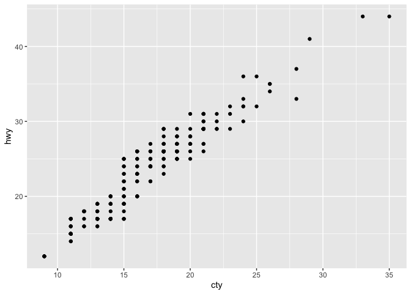

# Chapter 1
Kevin J. Coyle

``` r
library(palmerpenguins)
library(ggthemes)
library(pracma)  # for pracma::nthroot() in 1.4.3 Exercises
library(tidyverse)
```

    ── Attaching core tidyverse packages ──────────────────────── tidyverse 2.0.0 ──
    ✔ dplyr     1.1.4     ✔ readr     2.1.5
    ✔ forcats   1.0.0     ✔ stringr   1.5.1
    ✔ ggplot2   3.5.1     ✔ tibble    3.2.1
    ✔ lubridate 1.9.3     ✔ tidyr     1.3.1
    ✔ purrr     1.0.2     
    ── Conflicts ────────────────────────────────────────── tidyverse_conflicts() ──
    ✖ purrr::cross()  masks pracma::cross()
    ✖ dplyr::filter() masks stats::filter()
    ✖ dplyr::lag()    masks stats::lag()
    ℹ Use the conflicted package (<http://conflicted.r-lib.org/>) to force all conflicts to become errors

#### 1.2.5 Exercises

1.  How many rows are in `penguins`? How many columns?

``` r
nrow(penguins)
```

    [1] 344

``` r
ncol(penguins)
```

    [1] 8

2.  What does the `bill_depth_mm` variable in the `penguins` data frame
    describe? Read the help for
    [`?penguins`](https://allisonhorst.github.io/palmerpenguins/reference/penguins.html)
    to find out.

    `bill_depth_mm` is “a number denoting bill depth (millimeters)”

3.  Make a scatterplot of `bill_depth_mm` vs. `bill_length_mm`. That is,
    make a scatterplot with `bill_depth_mm` on the y-axis and
    `bill_length_mm` on the x-axis. Describe the relationship between
    these two variables.

``` r
  ggplot(data = penguins,
         aes(x = bill_length_mm, y = bill_depth_mm,
             color = species, shape = species)) +
  geom_point() +
  geom_smooth(method = "lm") +
  scale_color_colorblind()
```

    `geom_smooth()` using formula = 'y ~ x'

    Warning: Removed 2 rows containing non-finite outside the scale range
    (`stat_smooth()`).

    Warning: Removed 2 rows containing missing values or values outside the scale range
    (`geom_point()`).


These variables are correlated within species.

4.  What happens if you make a scatterplot of `species`
    vs. `bill_depth_mm`? What might be a better choice of geom?

``` r
  ggplot(data = penguins, aes(x = bill_depth_mm, y = species)) +
  geom_point()
```

    Warning: Removed 2 rows containing missing values or values outside the scale range
    (`geom_point()`).


`geom_boxplot()` would be a better geom.

5.  Why does the following give an error and how would you fix it?

``` r
ggplot(data = penguins) + 
  geom_point()
```

    Error in `geom_point()`:
    ! Problem while setting up geom.
    ℹ Error occurred in the 1st layer.
    Caused by error in `compute_geom_1()`:
    ! `geom_point()` requires the following missing aesthetics: x and y.

This causes an error because the aesthetics for `x` and `y` are missing.
Instead:

``` r
  ggplot(data = penguins, aes(x = bill_length_mm, y = bill_depth_mm)) +
  geom_point()
```

    Warning: Removed 2 rows containing missing values or values outside the scale range
    (`geom_point()`).


6.  What does the `na.rm` argument do in
    [`geom_point()`](https://ggplot2.tidyverse.org/reference/geom_point.html)?
    What is the default value of the argument? Create a scatterplot
    where you successfully use this argument set to `TRUE`.

`na.rm` removes missing values without a warning if it is set to `TRUE`.
The default value is `FALSE`.

``` r
  ggplot(data = penguins, aes(x = bill_length_mm, y = bill_depth_mm)) +
  geom_point(na.rm = TRUE)
```


7.  Add the following caption to the plot you made in the previous
    exercise: “Data come from the palmerpenguins package.” Hint: Take a
    look at the documentation for
    [`labs()`](https://ggplot2.tidyverse.org/reference/labs.html).

``` r
  ggplot(data = penguins, aes(x = bill_length_mm, y = bill_depth_mm)) +
  geom_point(na.rm = TRUE) +
  labs(
    caption = "Data come from the palmerpenguins package."
  )
```


8.  Recreate the following visualization. What aesthetic should
    `bill_depth_mm` be mapped to? And should it be mapped at the global
    level or at the geom level?

``` r
  ggplot(data = penguins, aes(x = body_mass_g, y = flipper_length_mm)) +
  geom_point(aes(color = bill_depth_mm), na.rm = TRUE) +
  geom_smooth(method = "lm", na.rm = TRUE)
```

    `geom_smooth()` using formula = 'y ~ x'


9.  Run this code in your head and predict what the output will look
    like. Then, run the code in R and check your predictions.

``` r
ggplot(
  data = penguins,
  mapping = aes(x = flipper_length_mm, y = body_mass_g, color = island)
) +
  geom_point() +
  geom_smooth(se = FALSE)
```

    `geom_smooth()` using method = 'loess' and formula = 'y ~ x'

    Warning: Removed 2 rows containing non-finite outside the scale range
    (`stat_smooth()`).

    Warning: Removed 2 rows containing missing values or values outside the scale range
    (`geom_point()`).


10. Will these two graphs look different? Why/why not?

``` r
ggplot(
  data = penguins,
  mapping = aes(x = flipper_length_mm, y = body_mass_g)
) +
  geom_point() +
  geom_smooth()
```

    `geom_smooth()` using method = 'loess' and formula = 'y ~ x'

    Warning: Removed 2 rows containing non-finite outside the scale range
    (`stat_smooth()`).

    Warning: Removed 2 rows containing missing values or values outside the scale range
    (`geom_point()`).


``` r
ggplot() +
  geom_point(
    data = penguins,
    mapping = aes(x = flipper_length_mm, y = body_mass_g)
  ) +
  geom_smooth(
    data = penguins,
    mapping = aes(x = flipper_length_mm, y = body_mass_g)
  )
```

    `geom_smooth()` using method = 'loess' and formula = 'y ~ x'

    Warning: Removed 2 rows containing non-finite outside the scale range (`stat_smooth()`).
    Removed 2 rows containing missing values or values outside the scale range
    (`geom_point()`).


They look the same because the aesthetics specified in the geoms in the
second plot are inherited by the geoms in the first plot.

#### 1.4.3 Exercises

1.  Make a bar plot of species of penguins, where you assign species to
    the y aesthetic. How is this plot different?

``` r
  ggplot(penguins, aes(y = species)) +
  geom_bar()
```


The bars are horizontal.

2.  How are the following two plots different? Which aesthetic, `color`
    or `fill`, is more useful for changing the color of bars?

``` r
ggplot(penguins, aes(x = species)) +
  geom_bar(color = "red")
```


``` r
ggplot(penguins, aes(x = species)) +
  geom_bar(fill = "red")
```


`color` changes only the color of the bars’ outline. `fill` is more
useful here, since it changes the color of the bar.

3.  What does the `bins` argument in
    [`geom_histogram()`](https://ggplot2.tidyverse.org/reference/geom_histogram.html)
    do?

The `bins` argument sets the number of bins in the histogram. It
defaults to 30.

4.  Make a histogram of the `carat` variable in the `diamonds` dataset
    that is available when you load the tidyverse package. Experiment
    with different binwidths. What binwidth reveals the most interesting
    patterns?

``` r
bins <- as.integer(pracma::nthroot(nrow(diamonds), 3) * 2)  # Rice's rule
bin_width <- (max(diamonds$carat) - min(diamonds$carat)) / bins
ggplot(diamonds, aes(x = carat)) +
  geom_histogram(binwidth = bin_width)
```


*Rice’s rule* looks like a good choice for calculating the number of
bins, and, correspondingly, an interesting `binwidth`.

#### 1.5.5 Exercises

1.  The `mpg` data frame that is bundled with the ggplot2 package
    contains 234 observations collected by the US Environmental
    Protection Agency on 38 car models. Which variables in `mpg` are
    categorical? Which variables are numerical? (Hint: Type
    [`?mpg`](https://ggplot2.tidyverse.org/reference/mpg.html) to read
    the documentation for the dataset.) How can you see this information
    when you run `mpg`?

``` r
mpg |> head()
```

    # A tibble: 6 × 11
      manufacturer model displ  year   cyl trans      drv     cty   hwy fl    class 
      <chr>        <chr> <dbl> <int> <int> <chr>      <chr> <int> <int> <chr> <chr> 
    1 audi         a4      1.8  1999     4 auto(l5)   f        18    29 p     compa…
    2 audi         a4      1.8  1999     4 manual(m5) f        21    29 p     compa…
    3 audi         a4      2    2008     4 manual(m6) f        20    31 p     compa…
    4 audi         a4      2    2008     4 auto(av)   f        21    30 p     compa…
    5 audi         a4      2.8  1999     6 auto(l5)   f        16    26 p     compa…
    6 audi         a4      2.8  1999     6 manual(m5) f        18    26 p     compa…

Categorical variables: *model, trans, drv  
*Numerical variables: *displ, year, cyl*

2.  Make a scatterplot of `hwy` vs. `displ` using the `mpg` data frame.
    Next, map a third, numerical variable to `color`, then `size`, then
    both `color` and `size`, then `shape`. How do these aesthetics
    behave differently for categorical vs. numerical variables?

``` r
ggplot(mpg, aes(x = displ, y = hwy)) +
  geom_point()
```


``` r
ggplot(mpg, aes(x = displ, y = hwy)) +
  geom_point(aes(color = cyl))
```


``` r
ggplot(mpg, aes(x = displ, y = hwy)) +
  geom_point(aes(size = cyl))
```


``` r
ggplot(mpg, aes(x = displ, y = hwy)) +
  geom_point(aes(color = cyl, size = cyl))
```


``` r
ggplot(mpg, aes(x = displ, y = hwy)) +
  geom_point(aes(shape = cyl))
```

    Error in `geom_point()`:
    ! Problem while computing aesthetics.
    ℹ Error occurred in the 1st layer.
    Caused by error in `scale_f()`:
    ! A continuous variable cannot be mapped to the shape aesthetic.
    ℹ Choose a different aesthetic or use `scale_shape_binned()`.

A numeric variable can’t be mapped to the `shape` aesthetic.

3.  In the scatterplot of `hwy` vs. `displ`, what happens if you map a
    third variable to `linewidth`?

``` r
ggplot(mpg, aes(x = displ, y = hwy)) +
  geom_point(aes(linewidth = cyl))
```

    Warning in geom_point(aes(linewidth = cyl)): Ignoring unknown aesthetics:
    linewidth


If you map a third variable to `linewidth`, it’s ignored.

4.  What happens if you map the same variable to multiple aesthetics?

It’s used for each aesthetic.

5.  Make a scatterplot of `bill_depth_mm` vs. `bill_length_mm` and color
    the points by `species`. What does adding coloring by species reveal
    about the relationship between these two variables? What about
    faceting by `species`?

``` r
ggplot(penguins, aes(x = bill_length_mm, y = bill_depth_mm,
                     color = species)) +
  geom_point()
```

    Warning: Removed 2 rows containing missing values or values outside the scale range
    (`geom_point()`).


`bill_depth_mm` and `bill_length_mm` appear to be correlated within
species.

6.  Why does the following yield two separate legends? How would you fix
    it to combine the two legends?

``` r
ggplot(
  data = penguins,
  mapping = aes(
    x = bill_length_mm, y = bill_depth_mm, 
    color = species, shape = species
  )
) +
  geom_point() +
  labs(color = "Species")
```

    Warning: Removed 2 rows containing missing values or values outside the scale range
    (`geom_point()`).


``` r
ggplot(
  data = penguins,
  mapping = aes(
    x = bill_length_mm,
    y = bill_depth_mm,
    color = species,
    shape = species
  )
) +
  geom_point()
```

    Warning: Removed 2 rows containing missing values or values outside the scale range
    (`geom_point()`).


It yields separate legends because `color = "Species"` in `labs`
overrides `color = species` in `ggplot`. To combine the two legends,
remove the `labs` call.

7.  Create the two following stacked bar plots. Which question can you
    answer with the first one? Which question can you answer with the
    second one?

``` r
ggplot(penguins, aes(x = island, fill = species)) +
  geom_bar(position = "fill")
```


``` r
ggplot(penguins, aes(x = species, fill = island)) +
  geom_bar(position = "fill")
```


The first plot shows the percentage of each species of the total on an
island. The second plot shows the distribution of a species across
islands.

#### 1.6.1 Exercises

1.  Run the following lines of code. Which of the two plots is saved as
    `mpg-plot.png`? Why?

``` r
ggplot(mpg, aes(x = class)) +
  geom_bar()
```


``` r
ggplot(mpg, aes(x = cty, y = hwy)) +
  geom_point()
```



``` r
ggsave("mpg-plot.png")
```

    Saving 7 x 5 in image

The second plot is saved because it’s the most recently created plot.

2.  What do you need to change in the code above to save the plot as a
    PDF instead of a PNG? How could you find out what types of image
    files would work in
    [`ggsave()`](https://ggplot2.tidyverse.org/reference/ggsave.html)?

``` r
ggsave("mpg-plot.pdf")
```

    Saving 7 x 5 in image

To save the plot as a PDF, change the extension to *pdf*. To find out
what types of image files are supported, see the documentation for
`ggsave()`. If the `device` argument is `NULL` (the default), the image
type is guessed based on the `filename` extension.
