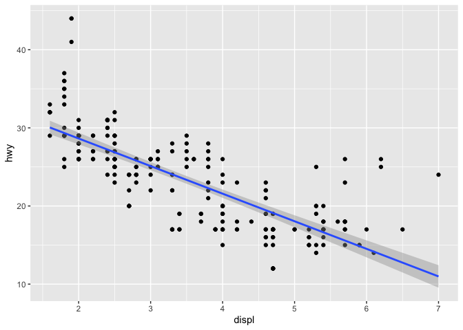

# Chapter 2
Kevin J. Coyle

``` r
library(tidyverse)
```

    ── Attaching core tidyverse packages ──────────────────────── tidyverse 2.0.0 ──
    ✔ dplyr     1.1.4     ✔ readr     2.1.5
    ✔ forcats   1.0.0     ✔ stringr   1.5.1
    ✔ ggplot2   3.5.1     ✔ tibble    3.2.1
    ✔ lubridate 1.9.3     ✔ tidyr     1.3.1
    ✔ purrr     1.0.2     
    ── Conflicts ────────────────────────────────────────── tidyverse_conflicts() ──
    ✖ dplyr::filter() masks stats::filter()
    ✖ dplyr::lag()    masks stats::lag()
    ℹ Use the conflicted package (<http://conflicted.r-lib.org/>) to force all conflicts to become errors

#### 2.5 Exercises

1.  Why does this code not work?

``` r
my_variable <- 10
my_varıable
```

    Error in eval(expr, envir, enclos): object 'my_varıable' not found

The “i” character is different in the two variable names.

2.  Tweak each of the following R commands so that they run correctly:

``` r
ggplot(data = mpg, mapping = aes(x = displ, y = hwy)) + 
  geom_point() +
  geom_smooth(method = "lm")
```

    `geom_smooth()` using formula = 'y ~ x'



3.  Press Option + Shift + K / Alt + Shift + K. What happens? How can
    you get to the same place using the menus?

Pressing this key combination presents a window with Keyboard Shortcut
Quick Reference help. Using the menus, Help-\>Keyboard Shortcuts Help
presents the same window.

4.  Let’s revisit an exercise from the [Section
    1.6](https://r4ds.hadley.nz/data-visualize#sec-ggsave). Run the
    following lines of code. Which of the two plots is saved as
    `mpg-plot.png`? Why?

``` r
my_bar_plot <- ggplot(mpg, aes(x = class)) +
  geom_bar()
my_scatter_plot <- ggplot(mpg, aes(x = cty, y = hwy)) +
  geom_point()
ggsave(filename = "mpg-plot.png", plot = my_bar_plot)
```

    Saving 7 x 5 in image

The first plot is saved to file as `mpg-plot.png` because the plot is
saved in the variable `my_bar_plot`, which is assigned to `plot` in the
call to `ggsave()`.
